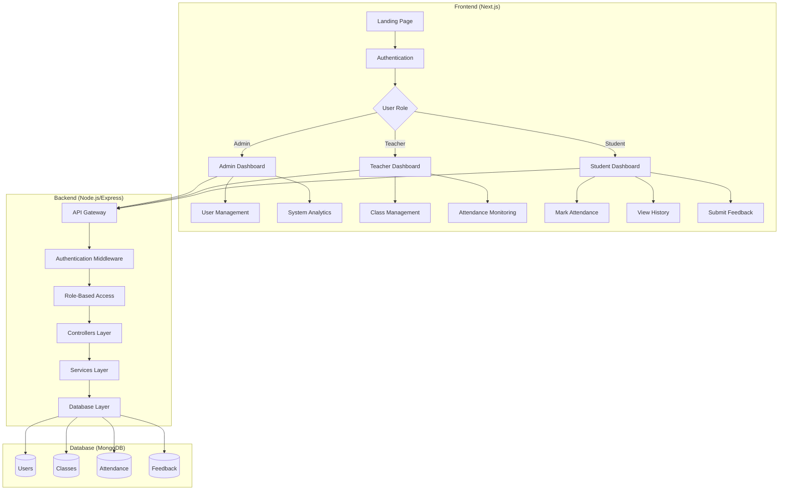
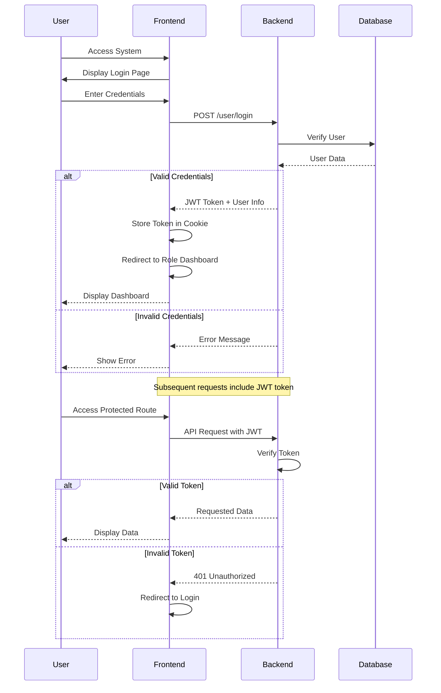
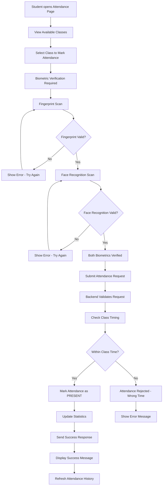

# Smart Attendance System

A comprehensive biometric-based attendance management system built with Next.js frontend and Node.js backend, featuring face recognition and fingerprint authentication for secure attendance tracking.

## 🌟 Features

### Core Functionality
- **Biometric Authentication**: Dual verification using fingerprint and face recognition
- **Role-Based Access Control**: Admin, Teacher, and Student dashboards with specific permissions
- **Real-Time Attendance**: Mark attendance with biometric verification
- **Class Management**: Create, schedule, and manage classes with materials
- **Analytics & Reports**: Track attendance statistics and success rates
- **Feedback System**: Student feedback collection and analysis

### Security & Authentication
- JWT-based authentication with secure token management
- Password hashing with bcrypt
- Role-based route protection
- Biometric template storage and verification

## 🏗️ System Architecture



## 🔄 Authentication Flow



## 📊 Attendance Marking Flow



## 🗄️ Database Schema

```mermaid
classDiagram
    class USER {
        +String id
        +String name
        +String email
        +String password
        +String role
        +String studentId
        +String teacherId
        +String fingerprintData
        +String faceData
        +Date createdAt
        +Date updatedAt
    }
    
    class CLASS {
        +String id
        +String className
        +String teacherId
        +Date date
        +Date startTime
        +Date endTime
        +String material
        +String status
        +Boolean teacherAttended
        +Number studentCount
        +Number attendedStudentCount
        +Date createdAt
    }
    
    class ATTENDANCE {
        +String id
        +String userId
        +String classId
        +String status
        +Boolean fingerprintVerified
        +Boolean faceVerified
        +Date timestamp
    }
    
    class FEEDBACK {
        +String id
        +String studentId
        +String classId
        +Number rating
        +String comment
        +Date createdAt
        +Date updatedAt
    }
    
    USER ||--o{ CLASS : teaches
    USER ||--o{ ATTENDANCE : attends
    USER ||--o{ FEEDBACK : provides
    CLASS ||--o{ ATTENDANCE : has
    CLASS ||--o{ FEEDBACK : receives
```

## 🚀 Quick Start

### Prerequisites
- Node.js 18+ and pnpm
- MongoDB database
- Git

### Installation

1. **Clone the repository**
   ```bash
   git clone <repository-url>
   cd smart-attendance-system
   ```

2. **Backend Setup**
   ```bash
   cd backend
   pnpm install
   
   # Create .env file
   echo "PORT=3001
   MONGODB_URI=your_mongodb_connection_string
   JWT_SECRET=your_jwt_secret_key" > .env
   
   # Start development server
   pnpm dev
   ```

3. **Frontend Setup**
   ```bash
   cd ../frontend
   pnpm install
   
   # Create .env.local file
   echo "NEXT_PUBLIC_API_URL=http://localhost:3001" > .env.local
   
   # Start development server
   pnpm dev
   ```

4. **Access the Application**
   - Frontend: http://localhost:3000
   - Backend API: http://localhost:3001

## 📡 API Endpoints

### Authentication
- `POST /user/register` - Register new user
- `POST /user/login` - User authentication
- `GET /user/profile` - Get user profile
- `PUT /user/biometric` - Update biometric data

### Attendance Management
- `POST /attendance/mark` - Mark attendance with biometric verification
- `GET /attendance/class/:classId` - Get class attendance records
- `GET /attendance/user` - Get user attendance history
- `GET /attendance/stats/:classId` - Get attendance statistics

### Class Management
- `POST /class` - Create new class (teachers/admins)
- `GET /class` - Get classes with filters
- `GET /class/:classId` - Get specific class details
- `PUT /class/:classId/material` - Update class material
- `GET /class/stats/:teacherId` - Get teacher's class statistics

### Feedback System
- `POST /feedback/submit` - Submit class feedback (students)
- `GET /feedback/class/:classId` - Get class feedback
- `GET /feedback/student` - Get student's feedback history
- `PUT /feedback/:feedbackId` - Update feedback

## 👥 User Roles & Permissions

### 🔑 Admin
- Full system access and user management
- View system-wide analytics and reports
- Monitor all classes and attendance
- Manage user roles and permissions

### 👨‍🏫 Teacher
- Create and manage classes
- Monitor class attendance and statistics
- Update class materials and schedules
- View student feedback for their classes

### 👨‍🎓 Student
- Mark attendance using biometric verification
- View personal attendance history and statistics
- Submit feedback for attended classes
- Update personal biometric data

## 🛠️ Technology Stack

### Frontend
- **Framework**: Next.js 15 with App Router
- **Language**: TypeScript
- **Styling**: Tailwind CSS
- **Authentication**: JWT with js-cookie
- **HTTP Client**: Axios
- **Icons**: Lucide React
- **Notifications**: React Toastify

### Backend
- **Runtime**: Node.js with Express.js
- **Language**: TypeScript
- **Database**: MongoDB with Mongoose
- **Authentication**: JWT & bcrypt
- **Validation**: Express-validator
- **CORS**: cors middleware

## 🔒 Security Features

- **Password Security**: bcrypt hashing with salt rounds
- **JWT Authentication**: Secure token-based authentication
- **Role-Based Access**: Route and API endpoint protection
- **Input Validation**: Comprehensive request validation
- **Biometric Verification**: Dual-factor biometric authentication
- **CORS Protection**: Cross-origin request security

## 🏃‍♂️ Development Workflow

### Backend Development
```bash
cd backend
pnpm dev          # Start development server
pnpm build        # Build for production
pnpm start        # Start production server
pnpm lint         # Run ESLint
```

### Frontend Development
```bash
cd frontend
pnpm dev          # Start development server
pnpm build        # Build for production
pnpm start        # Start production server
pnpm lint         # Run ESLint
```

## 📊 Business Logic

### Class Status Logic
- **SUCCESS**: Teacher attends and conducts class
- **EMPTY**: Teacher doesn't attend, class is cancelled

### Attendance Verification
- Both fingerprint AND face recognition must pass
- Attendance can only be marked during class time
- Students can only mark attendance for classes they're enrolled in

### Feedback Rules
- Students can only provide feedback for classes they attended
- Feedback includes rating (1-5) and optional comments
- Students can update their own feedback
